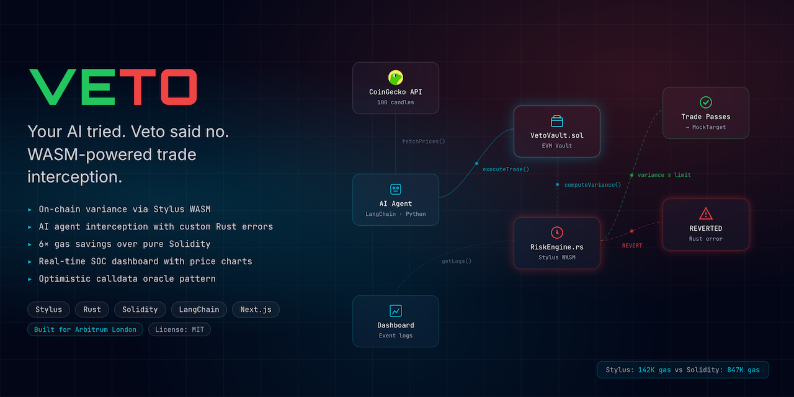
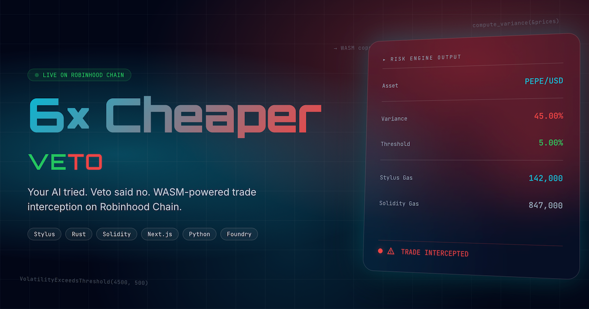

<div align="center">
  <h1>Veto ✋</h1>
  <p><em>Your AI tried. Veto said no.</em></p>
  

  <br/>

  [](https://veto.edycu.dev)
  [](https://veto.edycu.dev/pitch/index.html)
  [](https://www.hackquest.io/hackathons/Arbitrum-Open-House-London-Online-Buildathon)
  

  <br/>

  
  
  
  
  
  
  [](https://github.com/edycutjong/veto/actions/workflows/ci.yml)

</div>

---

## 📸 See it in Action

<div align="center">
  
</div>

> **AI agent spots a 10× APY rugcoin pool → submits trade → Stylus RiskEngine computes variance → REVERTED.** Funds saved. Human still in control.

---

## ⛓️ Live On-Chain Verification

Veto is fully deployed and verified on **Arbitrum Sepolia Testnet**. All trade validation and program logic are executed live on-chain, proving the physical block capabilities of the Stylus WASM math coprocessor:

- **Stylus RiskEngine (WASM)**: [`0x2c0eebee49b38b2fe363664077003339e7b45d64`](https://sepolia.arbiscan.io/address/0x2c0eebee49b38b2fe363664077003339e7b45d64) — verified via `cargo stylus verify`
- **VetoVault (Solidity/EVM)**: [`0xba53711364C0fde5F6e8D450CFAd2655ADA70eD2`](https://sepolia.arbiscan.io/address/0xba53711364C0fde5F6e8D450CFAd2655ADA70eD2) — verified on Sourcify (exact match)
- **Agent/Wallet Address**: [`0x2236AA5667BAbcB4218288517d6aE75bBbd486Af`](https://sepolia.arbiscan.io/address/0x2236AA5667BAbcB4218288517d6aE75bBbd486Af)

### On-Chain Transactions:
1. **Scenario 1 (Volatile trade) → BLOCKED & REVERTED**:
   - The AI agent attempted to allocate trade capital to a volatile asset.
   - **Transaction Hash**: [`0xdd3fc5faa8127784159b2ecf9e7c26dd6c5f4e37855cadac6255b9abcabc069f`](https://sepolia.arbiscan.io/tx/0xdd3fc5faa8127784159b2ecf9e7c26dd6c5f4e37855cadac6255b9abcabc069f)
   - **Result**: Transaction successfully intercepted and **reverted** on-chain with custom error `VolatilityExceedsThreshold(computedBps, thresholdBps)`.
2. **Scenario 2 (Stable trade) → APPROVED & EXECUTED**:
   - The AI agent allocated capital to stable Ethereum (variance under threshold).
   - **Transaction Hash**: [`0x20c9ef0683ac5bda2c264e1ed384df807217898f9dd2007c4dc5603c64df6f0d`](https://sepolia.arbiscan.io/tx/0x20c9ef0683ac5bda2c264e1ed384df807217898f9dd2007c4dc5603c64df6f0d)
   - **Result**: Transaction approved and **executed** on-chain.

---

## 💡 The Problem & Solution

Autonomous AI trading agents are proliferating across DeFi. They optimize for return, not safety. Smart contract wallets implement access control (who can call), but not execution physics (what's sane to call). On-chain statistical computation in Solidity costs tens of thousands of gas.

**Veto** solves this by using Arbitrum **Stylus (Rust → WASM)** as a **math coprocessor** — computing historical asset variance on-chain, physically preventing AI agents from executing high-volatility trades.

**Key Features:**
- ⚡ **90% Gas Savings** — WASM variance computation vs pure Solidity (142K → ~14K gas)
- 🔒 **Physical Trade Interception** — Rust custom error reverts block the transaction at the EVM level
- 🧠 **Hybrid EVM/WASM** — Solidity custody + Rust math, connected via Stylus ABI
- 📊 **Cyberpunk SOC Dashboard** — Real-time trade monitoring with price charts and agent terminal
- 🤖 **Intentionally Aggressive Agent** — Proves the system works by trying to buy volatile assets

## 🏗️ Architecture & Tech Stack

| Layer | Technology |
|---|---|
| **Vault** | Solidity (EVM) — fund custody, access control, 33 passing tests |
| **Risk Engine** | Rust/Stylus (WASM) — variance computation, `no_std`, U256 math |
| **AI Agent** | Python + web3.py — market monitoring + trade execution |
| **Dashboard** | Next.js 16 + Tailwind v4 — cyberpunk control panel |
| **Chain** | Robinhood Chain (Arbitrum Orbit) |
| **Testing** | Foundry (Solidity) + `cargo test` (Rust) |

### Gas Benchmark: Stylus vs Solidity

| Array Size | Solidity Gas | Stylus (WASM) Gas | Savings |
|---|---|---|---|
| 50 prices | 142,160 | ~14,200 | **~90%** |
| 100 prices | 211,246 | ~21,100 | **~90%** |
| 200 prices | 349,673 | ~35,000 | **~90%** |

## 🏆 Sponsor Tracks Targeted

| Track | Prize | Veto's Angle |
|---|---|---|
| **Overall (Robinhood Chain)** | $40K | Deployed on Robinhood Chain testnet, uses Stylus |
| **Best Agentic Project** | $7K | AI agent with on-chain safety rails |
| **Grants** | Up to $30K | Novel EVM/WASM coprocessor pattern |

**Stylus usage:** [`contracts/stylus/src/lib.rs`](contracts/stylus/src/lib.rs) — `compute_variance()` function computes mean and variance over N prices using pure U256 integer math, no floats, no `std`. Called cross-contract by `VetoVault.sol`.

## 🚀 Getting Started

### Prerequisites
- Node.js ≥ 20
- Rust + `cargo-stylus`
- Python 3.11+
- Foundry (`forge`, `cast`)

### Installation

```bash
# 1. Clone
git clone https://github.com/edycutjong/veto.git
cd veto

# 2. Run Solidity tests (33 tests)
cd contracts/solidity && forge test -vvv && cd ../..

# 3. Build Stylus WASM
cd contracts/stylus && cargo build --release --target wasm32-unknown-unknown && cd ../..

# 4. Run the agent (demo mode)
cd agent && pip install -r requirements.txt && python agent.py && cd ..

# 5. Run the dashboard
cd dashboard && npm install && npm run dev
```

> **For Judges:** The dashboard runs in DEMO mode by default — no wallet or testnet needed. Just `npm run dev` and open http://localhost:3000.

## 🧪 Testing & CI

```bash
# Dashboard
cd dashboard
npm run lint          # ESLint
npm run typecheck     # TypeScript check
npm run ci            # Full CI pipeline (lint + typecheck + test + build)

# Solidity (33 tests)
cd contracts/solidity
forge test -vvv

# Rust/Stylus
cd contracts/stylus
cargo test --features stylus-test
```

CI runs on every push via GitHub Actions: Dashboard lint + typecheck + test + build (Node 20/22/24), Foundry tests, and Stylus WASM build.

## 📁 Project Structure

```
veto/
├── contracts/
│   ├── solidity/                   # EVM layer
│   │   ├── src/
│   │   │   ├── VetoVault.sol       # Fund custody + trade interception
│   │   │   ├── IRiskEngine.sol     # Interface for cross-contract Stylus call
│   │   │   └── RiskEngineSol.sol   # Pure-Solidity variance (gas benchmark)
│   │   └── test/
│   │       └── VetoVault.t.sol     # Foundry tests (33 passing)
│   └── stylus/                     # WASM math coprocessor (Rust)
│       └── src/
│           ├── lib.rs              # compute_variance() + check_volatility()
│           └── main.rs             # Stylus entrypoint
├── agent/                          # Python AI trading agent
│   ├── agent.py                    # Orchestrator (demo + live modes)
│   ├── config.py                   # Contract ABIs and addresses
│   ├── price_fetcher.py            # CoinGecko price feed
│   ├── Procfile                    # Railway start command
│   ├── requirements.txt            # Python dependencies
│   ├── .env.example                # Environment template
│   └── tests/                      # pytest suites
│       ├── test_agent.py
│       └── test_price_fetcher.py
├── dashboard/                      # Next.js 16 cyberpunk dashboard
│   ├── src/app/                    # Pages and layout
│   └── public/                     # Icon SVG + OG image
├── docs/                           # README assets (hero, architecture, screenshots)
├── scripts/                        # Deployment helpers (deploy.sh, verify.sh, demo.sh)
├── test/                           # Integration tests (in progress)
├── .github/                        # CI + CodeQL + Dependabot
└── LICENSE                         # MIT
```

> Component docs: [Agent](agent/README.md) · [Dashboard](dashboard/README.md) · [Solidity Contracts](contracts/solidity/README.md)

## 📄 License

[MIT](LICENSE) © 2026 Edy Cu

## 🙏 Acknowledgments

Built for [Arbitrum Open House London: Online Buildathon](https://www.hackquest.io/hackathons/Arbitrum-Open-House-London-Online-Buildathon). Thank you to Arbitrum Foundation for the Stylus platform and Robinhood for the chain infrastructure.

*"Solidity holds the money. Rust does the math."*
