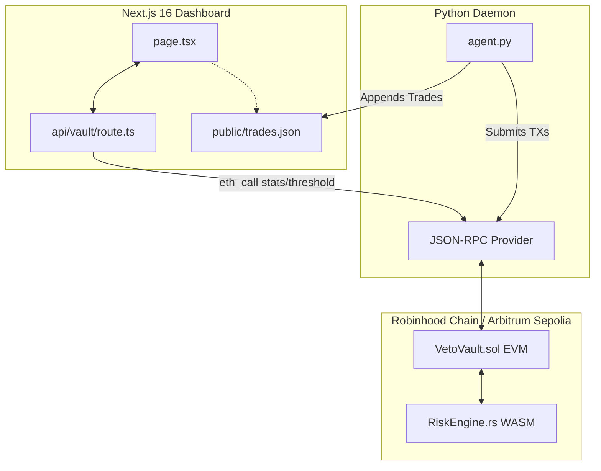

# Veto Security Operations Center (SOC) Dashboard 🛡️📊

This is the Next.js 16 frontend control center for **Veto**, a real-time EVM/WASM execution sandbox that uses Arbitrum Stylus (Rust) on Robinhood Chain to intercept and physically block high-volatility/hallucinated trades submitted by AI agents.

The dashboard functions as a military-grade SOC monitor, providing humans with live observability, threshold tuning, and direct control over autonomous agent trading behaviors.

---

<div align="center">
  <h3>⚡ Cyberpunk Control Terminal ⚡</h3>
  <p><em>"Your AI tried. Veto said no."</em></p>
</div>

---

## 🚀 Key Features

*   **Real-Time On-Chain Telemetry:** Direct RPC queries for live vault balance, execution statistics, and threshold settings from the [VetoVault](file:///Users/edycu/Projects/Hackathon/Veto/contracts/solidity/src/VetoVault.sol) contract using raw JSON-RPC over HTTPS.
*   **Dynamic Price Charting:** Clean SVG-based price series lines with animated gradient fills and glow filters, clearly indicating the maximum variance limit interface.
*   **Split-Pane Observability:** 
    *   **Execution Logs:** Direct visual list of approved and intercepted trade attempts complete with token details, calculated variance, and direct link verification to the Arbiscan Sepolia block explorer.
    *   **Agent Execution Terminal:** A real-time updating cyberpunk shell rendering the direct log stream of the Python daemon agent.
*   **Simulated Volatility Injector:** An integrated control dashboard simulation button triggering a client-side screen-shake and scanline alert effect to demonstrate real-time interception physics.
*   **Human Control Slider:** Interactive dashboard rendering of the maximum acceptable BPS (basis points) variance threshold, visualizing the on-chain risk parameters set by the owner.

---

## 🏗️ Technical Architecture & Data Flow



---

## 🛠️ Tech Stack

| Layer | Technology | Key Integration |
| :--- | :--- | :--- |
| **Framework** | Next.js 16 (App Router) | Handles routing and serves JSON-RPC bridge endpoints |
| **View Layer** | React 19 | Renders the terminal feed and telemetry tables with clean UI components |
| **Styling** | Tailwind CSS v4 | Provides custom glassmorphism containers, scanlines, and shake animations |
| **Testing** | Jest + RTL | Targets the API routes and page rendering flow (100% test coverage target) |
| **Static Types** | TypeScript | Strong typing for agent actions, telemetry states, and configurations |

---

## ⚙️ Configuration & Environment

The dashboard interacts with the blockchain through Next.js environment variables. See [dashboard/.env.example](file:///Users/edycu/Projects/Hackathon/Veto/dashboard/.env.example) for setup targets.

Create a `.env.local` file inside this directory:

```bash
# RPC URL (e.g. Alchemy, QuickNode, or public Robinhood Chain RPC)
NEXT_PUBLIC_RPC_URL=https://arb-sepolia.g.alchemy.com/v2/your-api-key

# Deployed Veto Vault Solidity Contract Address
NEXT_PUBLIC_VAULT_ADDRESS=0x77435CF556A3705496Aa3739bD3678D9edfcB69c

# Deployed Stylus WASM Risk Engine Address
NEXT_PUBLIC_RISK_ENGINE_ADDRESS=0x0a94398c550226ca01570afede89e378d81e9426
```

> [!NOTE]
> If `NEXT_PUBLIC_VAULT_ADDRESS` is not set or the RPC is unreachable, the dashboard defaults to **Demo Mode**, displaying mock data and transactions so judges can interact with it immediately.

---

## 💻 Commands

### Development
Start the local development server:
```bash
npm run dev
```

### Build & Deploy
Compile the production static bundle and optimize components:
```bash
npm run build
```

### Linting & Typing
Check for code style guidelines and compile-time type issues:
```bash
npm run lint
npm run typecheck
```

### Testing
Execute unit and integration tests:
```bash
npm run test           # Run test suite
npm run test:coverage  # Run test suite with full coverage report
```

### CI Pipeline
Run the full local CI validation suite (linting, typechecking, testing, and production compiling):
```bash
npm run ci
```

---

## 📂 Directory Structure

```
dashboard/
├── src/
│   └── app/
│       ├── api/
│       │   └── vault/
│       │       └── route.ts     # RPC communication bridge
│       ├── globals.css          # Scanlines, glow effects, glassmorphism UI
│       ├── layout.tsx           # Dashboard layout
│       └── page.tsx             # Main dashboard UI
├── public/
│   └── trades.json              # Shared trade attempts log
├── jest.config.ts               # Test configurations
└── package.json                 # Next.js / Tailwind build configuration
```

